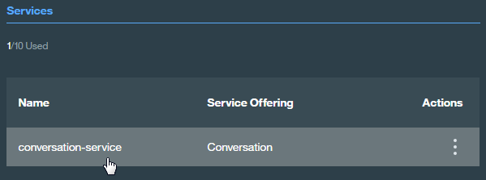
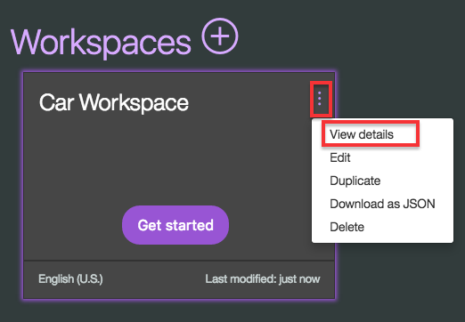

# Conversation Sample Application
[](http://travis-ci.org/watson-developer-cloud/conversation-simple)
[](https://codecov.io/github/watson-developer-cloud/conversation-simple?branch=master)

This Node.js app demonstrates the Conversation service in a simple chat interface simulating a cognitive car dashboard.

You can view a [demo][demo_url] of this app.

## Before you begin

* Create a Bluemix account
    * [Sign up][sign_up] in Bluemix, or use an existing account. Your account must have available space for at least 1 app and 1 service.
* Make sure that you have the following prerequisites installed:
    * The [Node.js][node_link] runtime (including the [npm][npm_link] package manager)
    * The [Cloud Foundry][cloud_foundry] command-line client

## Installing locally

If you want to modify the app or use it as a basis for building your own app, install it locally. You can then deploy your modified version of the app to the Bluemix cloud.

### Getting the files

Use GitHub to clone the repository locally, or [download the .zip file](https://github.com/watson-developer-cloud/conversation-simple/archive/master.zip) of the repository and extract the files.

### Setting up the Conversation service

1. At the command line, go to the local project directory (`conversation-simple`).

1. Connect to Bluemix with the Cloud Foundry command-line tool. For more information, see the Watson Developer Cloud [documentation][cf_docs].

1. Create an instance of the Conversation service in Bluemix. For example:

    ```bash
    cf create-service Conversation free conversation-simple-demo-test1
    ```

### Importing the Conversation workspace

1. In your browser, navigate to your Bluemix console.

1. From the **All Items** tab, click the newly created Conversation service in the **Services** list.

    

1. On the Service Details page, click **Launch tool**.

1. Click **Import** in the Conversation service tool. Specify the location of the workspace JSON file in your local copy of the app project:

    `<project_root>/training/car_workspace.json`

1. Select **Everything (Intents, Entities, and Dialog)** and then click **Import**. The car dashboard workspace is created.

### Configuring the app environment

1. Copy the `.env.example` file to a new `.env` file.

1. Create a service key in the format `cf create-service-key <service_instance> <service_key>`. For example:

    ```bash
    cf create-service-key conversation-simple-demo-test1 conversation-simple-demo-test1-key1
    ```

1. Retrieve the credentials from the service key using the command `cf service-key <service_instance> <service_key>`. For example:

    ```bash
    cf service-key conversation-simple-demo-test1 conversation-simple-demo-test1-key1
    ```

   The output from this command is a JSON object, as in this example:

    ```JSON
    {
      "password": "87iT7aqpvU7l",
      "url": "https://gateway.watsonplatform.net/conversation/api",
      "username": "ca2905e6-7b5d-4408-9192-e4d54d83e604"
    }
    ```

1. Paste  the `password` and `username` values (without quotation marks) from the JSON into the `CONVERSATION_PASSWORD` and `CONVERSATION_USERNAME` variables in the `.env` file. For example:

    ```
    CONVERSATION_USERNAME=ca2905e6-7b5d-4408-9192-e4d54d83e604
    CONVERSATION_PASSWORD=87iT7aqpvU7l
    ```

1. In your Bluemix console, open the Conversation service instance where you imported the workspace.

1. Click the menu icon in the upper-right corner of the workspace tile, and then select **View details**.

    

1. Click the  icon to copy the workspace ID to the clipboard.

1. On the local system, paste the workspace ID into the WORKSPACE_ID variable in the `.env` file. Save and close the file.

### Installing and starting the app

1. Install the demo app package into the local Node.js runtime environment:

    ```bash
    npm install
    ```

1. Start the app:

    ```bash
    npm start
    ```

1. Point your browser to http://localhost:3000 to try out the app.

## Testing the app

After your app is installed and running, experiment with it to see how it responds.

The chat interface is on the left, and the JSON that the JavaScript code receives from the Conversation service is on the right. Your questions and commands are interpreted using a small set of sample data trained with the following intents:

    turn_on
    turn_off
    turn_up
    turn_down
    traffic_update
    locate_amenity
    weather
    phone
    capabilities
    greetings
    goodbyes
    
Type a request, such as `music on` or `I want to turn on the windshield wipers`. The system understands your intent and responds. You can see the details of how your input was understood by examining the JSON data in the `Watson understands` section on the right side.

For example, if you type `Turn on some music`, the JSON data shows that the system understood the `turn_on` intent with a high level of confidence, along with the `appliance` entity with a value of `music`.

For more information about intents, see the [Conversation service documentation][doc_intents].

To see details of how these intents are defined, including sample input for each intent, launch the Conversation tool.

## Modifying the app

After you have the app deployed and running, you can explore the source files and make changes. Try the following:

* Modify the .js files to change the app logic.
* Modify the .html file to change the appearance of the app page.
* Use the Conversation tool to train the service for new intents, or to modify the dialog flow. For more information, see the [Conversation service documentation][docs_landing].
    
## Deploying to Bluemix

You can use Cloud Foundry to deploy your local version of the app to Bluemix.

1. In the project root directory, open the `manifest.yml` file:

    * In the `applications` section of the `manifest.yml` file, change the `name` value to a unique name for your version of the demo app.
    * In the `services` section, specify the name of the Conversation service instance you created for the demo app. If you do not remember the service name, use the `cf services` command to list all services you have created.
    * In the `env` section, add `WORKSPACE_ID` and specify the value from the `.env` file.

    The following example shows a modified `manifest.yml` file:

    ```YAML
    ---
    declared-services:
     conversation-service:
       label: conversation
       plan: free
    applications:
    - name: conversation-simple-app-test1
     command: npm start
     path: .
     memory: 256M
     instances: 1
     services:
     - conversation-simple-demo-test1
     env:
       NPM_CONFIG_PRODUCTION: false
       WORKSPACE_ID: fdeab5e4-0ebe-4183-8d10-6e5557a6d842
    ```

1. Push the app to Bluemix:

    ```bash
    cf push
    ```

    Access your app on Bluemix at the URL specified in the command output.

## Troubleshooting

If you encounter a problem, you can check the logs for more information. To see the logs, run the `cf logs` command:

```bash
cf logs <application-name> --recent
```

## License

  This sample code is licensed under Apache 2.0.
  Full license text is available in [LICENSE](LICENSE).

## Contributing

  See [CONTRIBUTING](CONTRIBUTING.md).

## Open Source @ IBM

  Find more open source projects on the
  [IBM Github Page](http://ibm.github.io/).


[cf_docs]: (https://www.ibm.com/watson/developercloud/doc/getting_started/gs-cf.shtml)
[cloud_foundry]: https://github.com/cloudfoundry/cli#downloads
[demo_url]: http://conversation-simple.mybluemix.net/
[doc_intents]: (http://www.ibm.com/watson/developercloud/doc/conversation/intent_ovw.shtml)
[docs]: http://www.ibm.com/watson/developercloud/doc/conversation/overview.shtml
[docs_landing]: (http://www.ibm.com/watson/developercloud/doc/conversation/index.shtml)
[node_link]: (http://nodejs.org/)
[npm_link]: (https://www.npmjs.com/)
[sign_up]: https://apps.admin.ibmcloud.com/manage/trial/bluemix.html?cm_mmc=WatsonDeveloperCloud-_-LandingSiteGetStarted-_-x-_-CreateAnAccountOnBluemixCLI
