# Conversation Sample Application
[](http://travis-ci.org/watson-developer-cloud/conversation-simple)
[](https://codecov.io/github/watson-developer-cloud/conversation-simple?branch=master)

This Node.js application demonstrates how the Conversation service uses intent capabilities in a simple chat interface.

[See the application demo](http://conversation-simple.mybluemix.net/).

For more information about Conversation, see the [detailed documentation](http://www.ibm.com/watson/developercloud/doc/conversation/overview.shtml).

## How the application works
The application interface is designed and trained for chatting with a cognitive car. The chat interface is on the left, and the
JSON that the JavaScript code receives from the server is on the right. Your questions and commands are interpreted using a small set of sample data trained with intents like these:

    turn_on
    weather
    capabilities

These intents help the system to understand variations of questions and commands that you might submit.

Example commands that can be executed by the Conversation service are:

    turn on windshield wipers
    play music

If you type `Wipers on` or `I want to turn on the windshield wipers`, the system
understands that in both cases your intent is the same and responds accordingly.

# Deploying the application

There are two ways you can deploy the application:

 * [**Deploying on Bluemix.**](#bluemix) You can use the IBM Bluemix web interface to set up the Conversation service and deploy the application in the IBM cloud. No software prerequisites are required; both the Conversation service and the demo application run in the Bluemix environment. Use this method if you want to get your instance of the application up and running quickly. You can subsequently make changes to the application using the Bluemix web interface.

 * [**Deploying locally.**](#local) You can use command-line tools to set up the Conversation service in the IBM cloud and then deploy the application in a local runtime environment. To use this method, you must have Node.js and Cloud Foundry installed locally. Use this method if you want to host the application on your system, or if you want to modify the application locally before deploying it to the Bluemix cloud.
 
  **Note:** Even if you are deploying locally, some steps currently require using the Bluemix web interface.

Regardless of which method you choose, you must have a Bluemix account, and your account must have available space for at least 1 application and 1 service. To register for a Bluemix account, go to https://console.ng.bluemix.net/registration/. Your Bluemix console shows your available space:


<a name="bluemix">
## Deploying on Bluemix
</a>

This procedure deploys the application code in the IBM cloud using the Bluemix web interface.

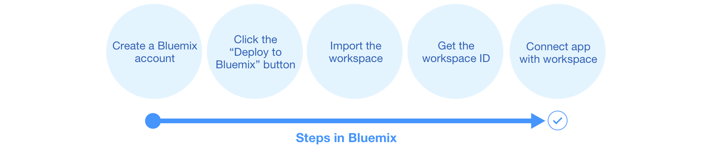

### Deploy the application and create the service

1. Click here to deploy the application directly from GitHub to Bluemix:

   [](https://bluemix.net/deploy?repository=https://github.com/watson-developer-cloud/conversation-simple)

1. When prompted, log in with an existing Bluemix account or sign up for a new account.

1. Verify the values in the **APP NAME**, **REGION**, **ORGANIZATION**, and **SPACE** fields. You can accept the default values or modify them.

   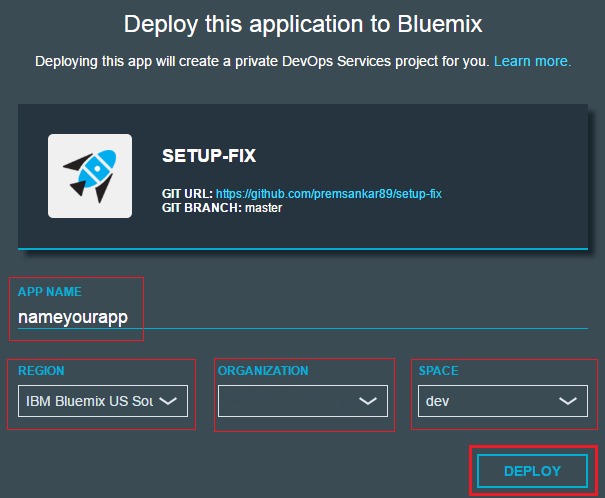

1. Click **DEPLOY**. This performs two actions:

  - Deploying the JavaScript application code from GitHub to Bluemix
  - Creating an instance of the Conversation service to be used by the application

  The Bluemix interface shows you the progress of the deployment process, which can take several minutes.

  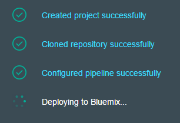

### Import the workspace

1. Download the workspace [JSON file](https://raw.githubusercontent.com/watson-developer-cloud/conversation-simple/master/training/car_workspace.json) to your computer. This file defines all of the artifacts used by the service, including intents, entities, and dialog flow.

1. In your browser, navigate to your Bluemix console.

1. From the **All Items** tab, click the newly created Conversation service in the **Services** list.

   

   The Service Details page opens.

1. Click **Launch tool**. 

   

   The Conversation service tool opens.

1. Click **Import**. When prompted, specify the location of the workspace JSON file you downloaded.

1. Select **Everything (Intents, Entities, and Dialog)** and then click **Import**. The car dashboard workspace is created.

### Configure the workspace ID

1. Click the menu icon in the upper right corner of the workspace tile, and then select **View details**.

   
   
   The tile shows the workspace details.
   
1. Click the  icon to copy the workspace ID to the clipboard.

1. Close the Conversation tool and return to your Bluemix console.

1. From the **All Items** tab, click the demo application in the **Cloud Foundry Applications** list.

   

   The Application Details page opens.

1. On the **Runtime** tab, click **Environment Variables**.

1. In the **User Defined** section, click **Add**.

1. In the **Name** field, type `WORKSPACE_ID`.

1. In the **Value** field, paste the workspace ID from the clipboard.

1. Click **Save**.

1. Click the  icon at the top of the page to restart the application.

The application is now deployed in Bluemix and ready to use. Click **View App** or go to the application route URL to try it out.

## Deploying locally

This procedure deploys the application code on your system and configures it to access Watson services in the IBM cloud.

**Note:** To deploy the application locally, you must have the following prerequisites installed:

* the [Node.js](http://nodejs.org/) runtime (including the npm package manager)
* the [Cloud Foundry command-line client](https://github.com/cloudfoundry/cli#downloads)

## Getting the files

1. Download the application code to your computer. You can do this in either of the following ways:

   * [Download the .zip file](https://github.com/watson-developer-cloud/conversation-simple/archive/master.zip) of the GitHub repository and extract the files to a local directory
   
   * Use GitHub to clone the repository locally
   
1. At the command line, go to the local project directory (`conversation-simple`).

## Setting up the service

1. Use the `cf login` command to log in to your Bluemix account.

1. Create an instance of the Conversation service in the IBM cloud:

   `cf create-service Conversation <service_plan> <service_instance>`
   
   For example:
   
   `cf create-service Conversation free conversation-simple-demo-test1`

1. Create a service key:

   `cf create-service-key <service_instance> <service_key>`   
   
   For example:

   `cf create-service-key conversation-simple-demo-test1 conversation-simple-demo-test1-key1`

## Setting up the application

1. Copy the `.env.example` file to a new `.env` file. Open this file in a text editor.

1. Retrieve the credentials from the service key:

   `cf service-key <service_instance> <service_key>`
   
   For example:

   `cf service-key conversation-simple-demo-test1 conversation-simple-demo-test1-key1`

   The output from this command is a JSON object.
   
1. In the JSON output, find the values for the `password` and `username` keys:

   ```javascript
   {
     "password": "87iT7aqpvU7l",
     "url": "https://gateway.watsonplatform.net/conversation/api",
     "username": "ca2905e6-7b5d-4408-9192-e4d54d83e604"
   }
   ```
   
   Paste these values (not including the quotation marks) into the `CONVERSATION_PASSWORD` and `CONVERSATION_USERNAME` variables in the `.env` file:
   
   ```
   CONVERSATION_USERNAME=ca2905e6-7b5d-4408-9192-e4d54d83e604
   CONVERSATION_PASSWORD=87iT7aqpvU7l
   ```

### Import the workspace

1. In your browser, navigate to your Bluemix console.

1. From the **All Items** tab, click the newly created Conversation service in the **Services** list.

   

   The Service Details page opens.

1. Click **Launch tool**. 

   

   The Conversation service tool opens.

1. Click **Import**. When prompted, specify the location of the workspace JSON file in your local copy of the application project:

   `<project_root>/training/car_workspace.json`

1. Select **Everything (Intents, Entities, and Dialog)** and then click **Import**. The car dashboard workspace is created.

### Configure the workspace ID

1. Click the menu icon in the upper right corner of the workspace tile, and then select **View details**.

   
   
   The tile shows the workspace details.
   
1. Click the  icon to copy the workspace ID to the clipboard.

1. On the local system, paste the workspace ID into the WORKSPACE_ID variable in the `.env` file. Save and close the file.

1. Install the demo application package into the local Node.js runtime environment:
   
   `npm install`

1. Start the application:

    `npm start`

The application is now deployed on the local system and ready to use. Go to `http://localhost:3000` in your browser to try it out.

### Optional: deploying from the local system to Bluemix

_Note: If you are interested in deploying you local application or the changes you have made locally to Bluemix, go to [this section](#usingCloudfoundry)_

<a name="credentials">
### Service Credentials
</a>

1 Go to the Bluemix Dashboard and select the Conversation service instance. Once there, select the **Service Credentials** menu item.

&nbsp;&nbsp;&nbsp;&nbsp;&nbsp;&nbsp;&nbsp;&nbsp;&nbsp;&nbsp;&nbsp;&nbsp;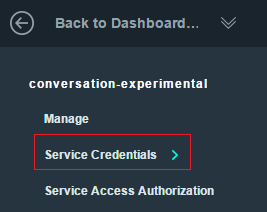

2 Select **ADD CREDENTIALS**. Name your credentials then select **ADD**.

3 Copy the credentials (or remember this location) for later use.


<a name="workspace">
### Import a workspace
</a>

To use the app you're creating, you need to add a worksapce to your Conversation service. A workspace is a container for all the artifacts that define the behavior of your service (ie: intents, entities and chat flows). For this sample app, a workspace is provided.

For more information on workspaces, see the full  [Conversation service  documentation](https://www.ibm.com/smarterplanet/us/en/ibmwatson/developercloud/doc/conversation/overview.shtml).

1 Navigate to the Bluemix dashboard, select the Conversation service that you created.

2 Go to the **Manage** menu item and select **Launch Tool**. This opens a new tab in your browser, where you are prompted to login if you have not done so before. Use your Bluemix credentials.

3 If you are deploying through Bluemix, download the [exported JSON file](https://raw.githubusercontent.com/watson-developer-cloud/conversation-simple/master/training/car_workspace.json) that contains the Workspace contents. If deploying locally,  this was cloned and is in the training folder (training/car_workspace.json).

4 Select the import icon: . Browse to (or drag and drop) the JSON file. Choose to import **Everything(Intents, Entities, and Dialog)**. Then select **Import** to finish importing the workspace.

5 Refresh your browser. A new workspace tile is created within the tooling. Select the _menu_ button within the workspace tile, then select **View details**:

&nbsp;&nbsp;&nbsp;&nbsp;&nbsp;&nbsp;&nbsp;&nbsp;&nbsp;&nbsp;&nbsp;&nbsp;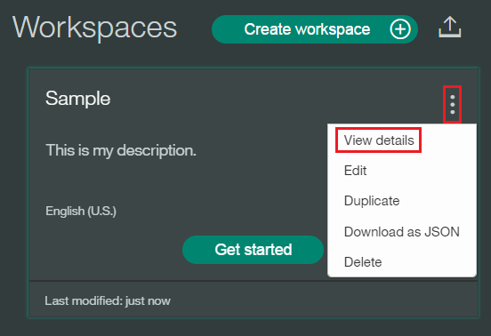

<a name="workspaceID">
In the Details UI, copy the 36 character UNID **ID** field. This is the **Workspace ID**.
</a>

&nbsp;&nbsp;&nbsp;&nbsp;&nbsp;&nbsp;&nbsp;&nbsp;&nbsp;&nbsp;&nbsp;&nbsp; 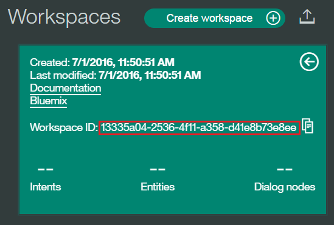

6 Return to the deploy steps that you were following:
- For Local - [return to step 2](#returnlocal)
- For Bluemix - [return to step 5](#returnbluemix)

<a name="env">
### Adding environment variables in Bluemix
</a>

1 In Bluemix, open the application from the Dashboard. Select **Environment Variables**.

2 Select **USER-DEFINED**.

3 Select **ADD**.

4 Add a variable with the name **WORKSPACE_ID**. For the value, paste in the Workspace ID you [copied earlier](#workspaceID). Select **SAVE**.

&nbsp;&nbsp;&nbsp;&nbsp;&nbsp;&nbsp;&nbsp;&nbsp;&nbsp;&nbsp;&nbsp;&nbsp;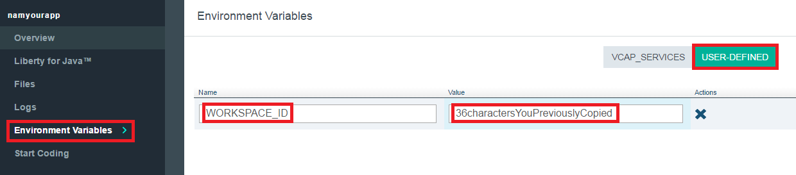

5 Restart your application.

<a name="usingCloudfoundry">
### Using Cloudfoundry CLI tool to deploy your application
</a>

To build the application:

1 Download and install the [Cloudfoundry CLI](https://github.com/cloudfoundry/cli) tool.

2 Git clone the project `https://github.com/watson-developer-cloud/conversation-simple`

3 Navigate to the `conversation-simple` folder

4 Connect to Bluemix in the command-line tool:

 For US Region

 ```sh

 $ cf api https://api.ng.bluemix.net

 ```

 ```sh

 $ cf login -u <your user ID>

 ```

5 Create the Conversation service in Bluemix:

 ```sh

 $ cf create-service conversation free conversation-service

 ```

6 Push it live:

 ```sh

 $ cf push <application-name>

 ```
 The name you use determinates your application URL initially, such as `<application-name>.mybluemix.net`.

<a name="local">
## Deploying locally
</a>


<a name="returnlocal">
2 In Bluemix, [create a Conversation Service](http://www.ibm.com/watson/developercloud/doc/conversation/convo_getstart.shtml).
- [Import a workspace](#workspace)
- Copy the [Service Credentials](#credentials) for later use.
- <b>Return to these steps</b>
</a>

# Troubleshooting in Bluemix

#### In the Classic Experience:
- Log in to Bluemix, you'll be taken to the dashboard.
- Navigate to the the application you previously created.
- Select **Logs**.

&nbsp;&nbsp;&nbsp;&nbsp;&nbsp;&nbsp;&nbsp;&nbsp;&nbsp;&nbsp;&nbsp;&nbsp;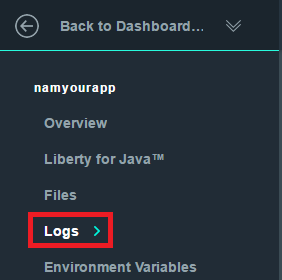

- If you want, filter the LOG TYPE by "APP".

&nbsp;&nbsp;&nbsp;&nbsp;&nbsp;&nbsp;&nbsp;&nbsp;&nbsp;&nbsp;&nbsp;&nbsp;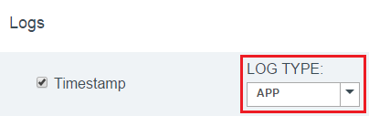

#### In the new Bluemix:
- Log in to Bluemix, you'll be taken to the dashboard.
- Select **Compute**

&nbsp;&nbsp;&nbsp;&nbsp;&nbsp;&nbsp;&nbsp;&nbsp;&nbsp;&nbsp;&nbsp;&nbsp;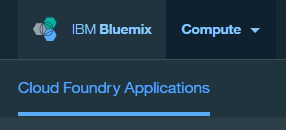

- Select the application you previously created.
- Select **Logs**.

&nbsp;&nbsp;&nbsp;&nbsp;&nbsp;&nbsp;&nbsp;&nbsp;&nbsp;&nbsp;&nbsp;&nbsp;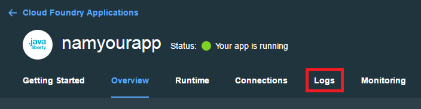

- If you want, filter the Log Type by selecting the drop-down and selecting **Application(APP)**.

&nbsp;&nbsp;&nbsp;&nbsp;&nbsp;&nbsp;&nbsp;&nbsp;&nbsp;&nbsp;&nbsp;&nbsp;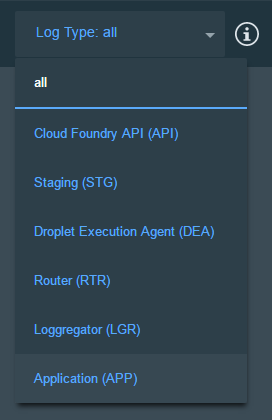

# Troubleshooting with CLI

To see the logs, run the command

`$ cf logs < application-name > --recent`

# License

  This sample code is licensed under Apache 2.0.
  Full license text is available in [LICENSE](LICENSE).

# Contributing

  See [CONTRIBUTING](CONTRIBUTING.md).


## Open Source @ IBM

  Find more open source projects on the
  [IBM Github Page](http://ibm.github.io/).
