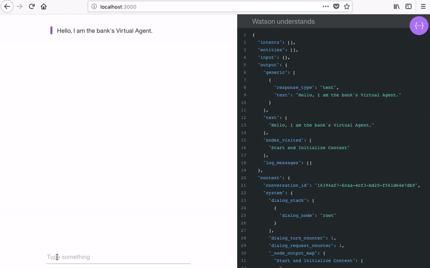

# Watson Assistant Quickstart

IBM Watson Assistant for IBM Cloud Pak for Data combines machine learning, natural language understanding, and an integrated dialog editor to create conversation flows between your apps and your users.  

This Node.js app demonstrates the Watson Assistant service in a simple interface engaging in a series of simple simulated banking tasks.

This quickstart will get you up and running on any OpenShift cluster including a local [minishift](https://www.okd.io/minishift) running on your machine.



You can view a [demo](http://conversation-simple.ng.bluemix.net/) of this app.

## Getting started

### Installing the Watson Assistant add-on on IBM Cloud Pak for Data 

Make your data ready for an AI and multicloud world. Cloud Pak for Data System is an all-in-one cloud-native Data and AI platform in a box, providing a pre-configured, governed, and secure environment to collect, organize and analyze data. [Learn more](https://docs-icpdata.mybluemix.net/docs/content/SSQNUZ_current/com.ibm.icpdata.doc/zen/overview/overview.html).

Installing Cloud Pak for Data - [instructions](https://www.ibm.com/support/producthub/icpdata/docs/content/SSQNUZ_current/cpd/install/install.html)

Installing the Watson Assistant add-on - [instructions](https://www.ibm.com/support/producthub/icpdata/docs/content/SSQNUZ_current/cpd/svc/watson/wavi.html)

### Create your own copy of this repo
Fork a copy of this repo.

### Configuring the Watson Assistant instance

1. In your Cloud Pak for Data console, open the Watson Assistant service instance and click on **Open Watson Assistant**.

2. Create a new skill: under the **Skills** tab click on **Create skill** and select **Dialog skill**. Under **Import skill**, click the **Choose JSON FIle** button and specify the location of the workspace JSON file in your local copy of the app project:
                                                                                                                               
     `<project_root>/training/bank_simple_workspace.json`
 
    Select **Everything (Intents, Entities, and Dialog)** and then click **Import**. The skill is created.

3. Create a new assistant: under the **Assistants** tab click on **Create assistant**, give it a name such as **bank assistant** and click on **Create assistant**. Click on **Add dialog skill** and select the **Banking_Simple_DO_NOT_DELETE** skill.

4. Click on the menu icon in the upper-right corner, and then select **Settings**. Inside **API Details** you can find your **Assistant ID**. We will use it later so it's a good idea to copy and paste it somewhere.

### Creating a project

After logging in with `oc login`, ensure that you have a project set up. If not, create one as follows:

        $ oc new-project watson-assistant-project --display-name="Watson Assistant Project"

That's it, project has been created. Ensure that your current project is set:

        $ oc project watson-assistant-project

### Creating the app from a template

The template for this example is located at [watson-assistant-quickstart.json](openshift/templates/watson-assistant-quickstart.json).

First, list the available parameters:

        $ oc process --parameters -f https://raw.githubusercontent.com/watson-developer-cloud/assistant-simple/master/cloud_pak_for_data_quickstart/openshift/templates/watson-assistant-quickstart.json

The following parameters are required, You can find them by clicking on your Watson Assistant instance in the Cloud Pak for Data console:
1. `BEARER_TOKEN`
2. `ASSISTANT_URL`
* For security reasons, don't use this token in production.

Create the app from the template. Specify the `SOURCE_REPOSITORY_URL` to be the url of your forked repo. If you are using a self-signed certificate then set DISABLE_SSL_VERIFICATION to true

        $ oc new-app -f \
        https://raw.githubusercontent.com/watson-developer-cloud/assistant-simple/master/cloud_pak_for_data_quickstart/openshift/templates/watson-assistant-quickstart.json \
        -p BEARER_TOKEN=<your bearer token> \
        -p ASSISTANT_URL=<your assistant url> \
        -p ASSISTANT_ID=<your assistant id> \
        -p SOURCE_REPOSITORY_URL=<your repository location> \
        -p DISABLE_SSL_VERIFICATION=false 

`oc new-app` will kick off a build once all required dependencies are confirmed.


#### Check the status


Check the status of your new nodejs app with the command:

        $ oc status
        
        
Which should return something like:

        In project Watson Assistant Project (watson-assistant-project) on server https://10.2.2.2:8443

         svc/watson-assistant-quickstart - 172.30.108.183:8080
          dc/watson-assistant-quickstart deploys istag/watson-assistant-quickstart:latest <-
            bc/watson-assistant-quickstart source builds https://github.com/watson-developer-cloud/assistant-simple on openshift/nodejs:10
              build #1 running for 7 seconds
            deployment #1 waiting on image or update        
        

#### Custom Routing

An OpenShift route exposes a service at a host name, like www.example.com, so that external clients can reach it by name.

DNS resolution for a host name is handled separately from routing; you may wish to configure a cloud domain that will always correctly resolve to the OpenShift router, or if using an unrelated host name you may need to modify its DNS records independently to resolve to the router.

That aside, let's explore our new web app. `oc new-app` created a new route. To view your new route:

        $ oc get route

In the result you can find all routes in your project and for each route you can find its hostname.  
Find the `watson-assistant-quickstart` route and use the hostname to navigate to the newly created Node.js web app.
Notice that you can use the `APPLICATION_DOMAIN` template parameter to define a hostname for your app.

To create a new route at a host name, like www.example.com:

        $ oc expose svc/watson-assistant-quickstart --hostname=www.example.com


#### Optional diagnostics
        
If the build is not yet started (you can check by running `oc get builds`), start one and stream the logs with:

        $ oc start-build watson-assistant-quickstart --follow

Deployment happens automatically once the new application image is available.  To monitor its status either watch the web console or execute `oc get pods` to see when the pod is up.  Another helpful command is

        $ oc get svc
        
        
This will help indicate what IP address the service is running, the default port for it to deploy at is 8080. Output should look like:

        NAME                          CLUSTER-IP       EXTERNAL-IP   PORT(S)    AGE
        watson-assistant-quickstart   172.30.249.251   <none>        8080/TCP   7m                


### Adding Webhooks and Making Code Changes
Assuming you used the URL of your own forked repository, you can configure your github repository to make a webhook call whenever you push your code. Learn more about [Webhook Triggers](https://docs.openshift.com/container-platform/3.5/dev_guide/builds/triggering_builds.html#webhook-triggers).

1. From the OpenShift web console homepage, navigate to your project
2. Go to Builds
3. Click the link with your BuildConfig name
4. Click the Configuration tab
5. Click the "Copy to clipboard" icon to the right of the "GitHub webhook URL" field
6. Navigate to your repository on GitHub and click on repository settings > webhooks > Add webhook
7. Paste your webhook URL provided by OpenShift
8. Leave the defaults for the remaining fields - That's it!
9. After you save your webhook, refresh your Github settings page and check the status to verify connectivity.  


### Testing the app

After your app is installed and running, experiment with it to see how it responds.

The chat interface is on the left, and the JSON that the JavaScript code receives from the Watson Assistant service is on the right. Your questions and commands are interpreted using a small set of sample data trained with the banking intents.

* Visit the documentation to learn more about [intents](https://cloud.ibm.com/docs/services/assistant/intents.html#defining-intents) and [entities](https://cloud.ibm.com/docs/services/assistant/entities.html#defining-entities)


### Learn more about [OpenShift templates](https://docs.openshift.com/enterprise/3.0/dev_guide/templates.html#dev-guide-templates).


### Running locally

Follow the steps below to run the app locally:

1. First install [Node.js](https://nodejs.org) ([LTS](https://github.com/nodejs/Release) supported versions).

2. In the application folder, copy the *.env.example* file and create a file called *.env*
       
    ```sh
    cp .env.example .env
    ```       

7. Open the *.env* file and add `BEARER_TOKEN`, `ASSISTANT_URL`, `ASSISTANT_ID` and `DISABLE_SSL_VERIFICATION=true` if you are using a self-signed certificate.
    
3. Install the dependencies:

    ```sh
    npm install
    ```

4. Start the app:

    ```sh
    npm start
    ```

5. Point your browser to [localhost:3000](http://localhost:3000).


## License

  This sample code is licensed under Apache 2.0.
